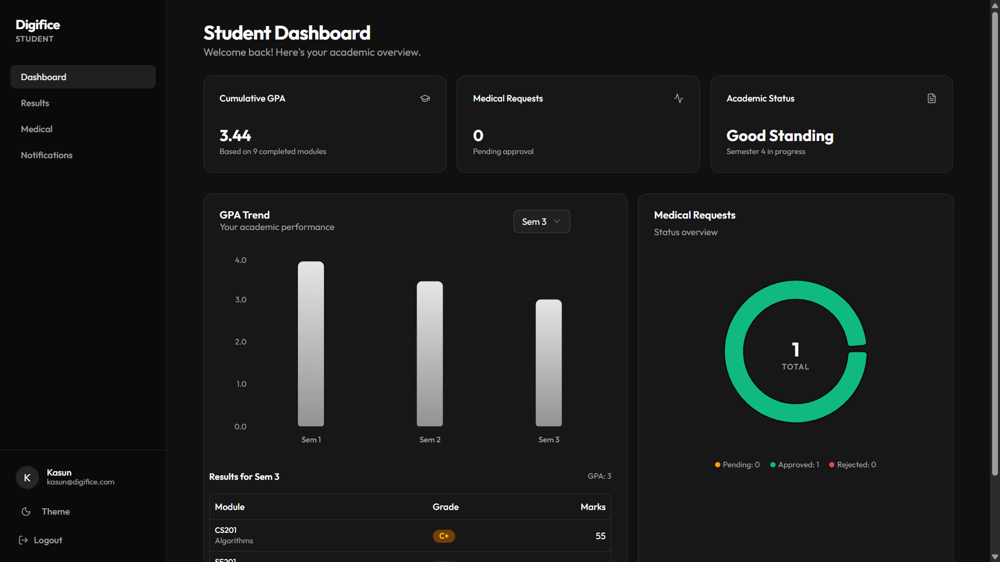
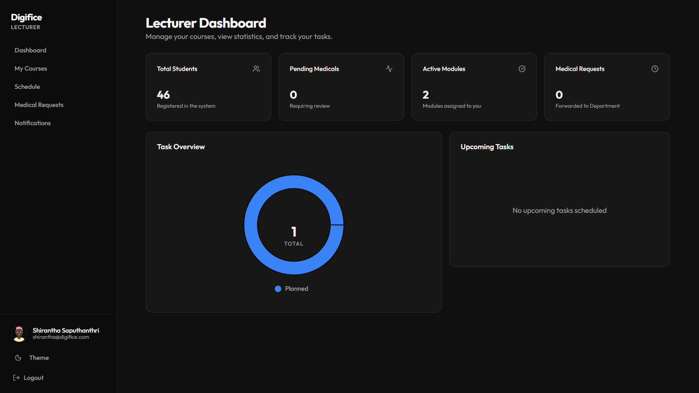
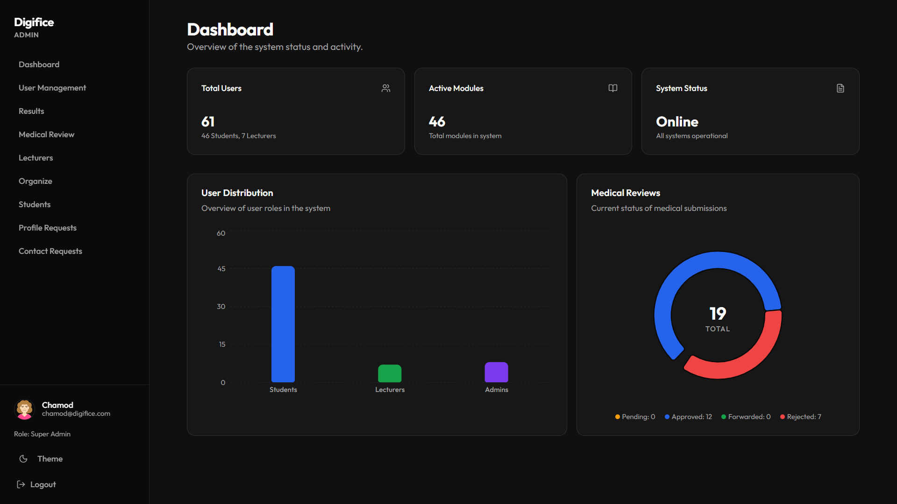

<p align="center">
  
</p>

<p align="center">
  <strong>Digifice transforms traditional university processes into a smooth digital experience — faster, smarter, and future-ready.</strong>
</p>

---


---

## 📚 Project Overview

**Digifice** is a role-based web application designed to centralize academic and administrative processes for a university. The system provides separate dashboards for **Students**, **Lecturers**, and **Administrators**, ensuring secure and efficient access to features based on user roles.

The platform enables **seamless result management, GPA tracking, medical submission workflows, course management, and real-time notifications** - all within a modern, responsive interface.

This project is developed as part of the **Independent Study Project II** for the BICT degree program at **Uva Wellassa University of Sri Lanka (2022/2023 Batch)**.

---

## 🚀 Key Features

- **🔐 Authentication & Role-Based Access**
  - Secure login with NextAuth & JWT
  - Role-based route protection via middleware
  - Three distinct roles: **Student / Lecturer / Admin**
  - Password reset & account recovery

- **🎓 Student Dashboard**
  - View exam results & semester-wise GPA
  - Interactive GPA analytics with charts
  - Submit and track medical requests
  - Receive notifications & announcements
  - Update personal profile

- **👨‍🏫 Lecturer Dashboard**
  - Manage assigned courses & modules
  - View student medical submissions
  - Schedule management
  - Post announcements & notifications
  - Task reminders & profile management

- **🛠️ Admin Dashboard**
  - Full user management (CRUD for students, lecturers, admins)
  - Bulk student upload via Excel templates
  - Upload & manage exam results
  - Review & approve medical submissions
  - Contact request management
  - Student management with enrollment tracking
  - System-wide announcements & notifications

- **📊 Analytics & Visualization**
  - Interactive charts using Recharts
  - GPA trend analysis for students
  - Dashboard statistics & overview cards

- **📋 Medical Submission System**
  - Students submit medical requests with documents
  - Lecturers & admins review submissions
  - Status tracking (pending, approved, rejected)
  - Date validation to prevent future submissions

- **📢 Notifications & Announcements**
  - Centralized announcement system
  - Real-time notification alerts
  - Role-specific notification routing

- **🌗 Theme Support**
  - Dark/Light mode toggle
  - Font size accessibility options
  - Responsive design for all screen sizes

---

## 🛠️ Tech Stack

| Layer               | Technology                                          |
| ------------------- | --------------------------------------------------- |
| **Frontend**        | Next.js 16 (React 19), Tailwind CSS 4, TypeScript   |
| **Backend**         | Next.js API Routes (Node.js)                        |
| **Database**        | MongoDB Atlas (Mongoose 9)                          |
| **Authentication**  | NextAuth.js (JWT-based sessions)                    |
| **UI Components**   | Radix UI, Lucide Icons, shadcn/ui                   |
| **Charts**          | Recharts                                            |
| **Forms**           | React Hook Form + Zod validation                    |
| **Data Tables**     | TanStack React Table                                |
| **File Processing** | xlsx (Excel import/export)                          |
| **Styling**         | Tailwind CSS, class-variance-authority, tailwind-merge |
| **Version Control** | Git + GitHub                                        |

---

## 🏗️ Project Structure

```
digifice/
│
├── app/                              # Next.js App Router (pages, layouts, routing)
│   ├── (auth)/                       # Authentication routes
│   │   ├── login/                    # Login page
│   │   └── signup/                   # Signup page
│   │
│   ├── (dashboard)/                  # All role-based dashboards
│   │   ├── admin/                    # Admin dashboard
│   │   │   ├── layout.tsx            # Admin layout (sidebar/header)
│   │   │   ├── page.tsx              # Admin dashboard home
│   │   │   ├── users/                # User management
│   │   │   ├── students/             # Student directory
│   │   │   ├── student-management/   # Bulk student operations
│   │   │   ├── lecturers/            # Lecturer management
│   │   │   ├── results/              # Result upload & management
│   │   │   ├── medical/              # Medical submission review
│   │   │   ├── contact-requests/     # Contact request handling
│   │   │   └── requests/             # Profile & other requests
│   │   │
│   │   ├── lecturer/                 # Lecturer dashboard
│   │   │   ├── layout.tsx            # Lecturer layout
│   │   │   ├── page.tsx              # Lecturer dashboard home
│   │   │   ├── courses/              # Course management
│   │   │   ├── medicals/             # Medical submissions review
│   │   │   ├── schedules/            # Schedule management
│   │   │   ├── notifications/        # Notifications
│   │   │   └── profile/              # Profile settings
│   │   │
│   │   ├── student/                  # Student dashboard
│   │   │   ├── layout.tsx            # Student layout
│   │   │   ├── page.tsx              # Student dashboard home
│   │   │   ├── results/              # Exam results & GPA
│   │   │   ├── medical/              # Medical submission
│   │   │   ├── notifications/        # Notifications
│   │   │   └── profile/              # Profile settings
│   │
│   ├── api/                          # Backend API routes
│   │   ├── auth/                     # Authentication APIs
│   │   ├── users/                    # User CRUD APIs
│   │   ├── admin/                    # Admin-specific APIs
│   │   ├── lecturer/                 # Lecturer-specific APIs
│   │   ├── student/                  # Student-specific APIs
│   │   ├── results/                  # Results & GPA APIs
│   │   ├── medical/                  # Medical submission APIs
│   │   ├── modules/                  # Module management APIs
│   │   ├── notices/                  # Notice/announcement APIs
│   │   ├── hierarchy/                # Faculty/Dept hierarchy APIs
│   │   ├── contact/                  # Contact request APIs
│   │   ├── profile/                  # Profile update APIs
│   │   ├── stats/                    # Dashboard statistics APIs
│   │   ├── upload/                   # File upload APIs
│   │   └── seed/                     # Database seeding APIs
│   │
│   ├── about/                        # About page
│   ├── contact/                      # Contact page
│   ├── features/                     # Features page
│   ├── news/                         # News page
│   ├── layout.tsx                    # Root app layout
│   ├── page.tsx                      # Public landing page
│   └── not-found.tsx                 # 404 page
│
├── components/                       # Reusable UI components
│   ├── ui/                           # Base UI primitives (shadcn/ui)
│   ├── dashboard/                    # Dashboard widgets & cards
│   ├── users/                        # User management components
│   ├── results/                      # Result display components
│   ├── modules/                      # Module components
│   ├── admin/                        # Admin-specific components
│   └── providers/                    # Context providers
│
├── models/                           # Mongoose schemas & models
│   ├── User.ts                       # User model (student, lecturer, admin)
│   ├── Result.ts                     # Exam results model
│   ├── Medical.ts                    # Medical submissions model
│   ├── Module.ts                     # Course modules model
│   ├── Faculty.ts                    # Faculty model
│   ├── Department.ts                 # Department model
│   ├── DegreeProgram.ts              # Degree program model
│   ├── Enrollment.ts                 # Student enrollment model
│   ├── Notice.ts                     # Announcements model
│   ├── Notification.ts              # Notifications model
│   ├── NotificationState.ts         # Notification read state
│   ├── ContactRequest.ts            # Contact form submissions
│   ├── ProfileRequest.ts            # Profile update requests
│   ├── LecturerTask.ts              # Lecturer task reminders
│   └── Hierarchy.ts                 # Academic hierarchy model
│
├── hooks/                            # Custom React hooks
├── lib/                              # Core libraries & configs
│   ├── db.ts                         # MongoDB connection
│   └── auth.ts                       # NextAuth configuration
│
├── scripts/                          # Database seeding & utilities
│   ├── seed.js                       # Main database seeder
│   ├── seed_lecturer.js              # Lecturer seeder
│   ├── seed_medicals.js              # Medical data seeder
│   ├── seed_results.js               # Results seeder
│   └── fix-degrees.js                # Degree data fix script
│
├── types/                            # Global TypeScript types
├── middleware.ts                      # Route protection & role-based access
├── public/                           # Static assets & images
├── .env.local                        # Environment variables
├── next.config.ts                    # Next.js configuration
├── tsconfig.json                     # TypeScript configuration
└── package.json                      # Dependencies & scripts
```

---

## 🏗️ System Development Approach

The project follows an **iterative development model** with a feature-based architecture. Each feature module (results, medical, notifications, etc.) is built as an independent unit with its own API routes, components, and models — enabling parallel development and easy scalability.

---

## ⚙️ Setup & Installation

Follow these steps to run **Digifice** locally on your computer:

### 1. Clone the Repository
```bash
git clone https://github.com/chamod-malindu/digifice.git
cd digifice
```

### 2. Install Dependencies
```bash
npm install
```

### 3. Create a `.env.local` File
Create a `.env.local` file in the root directory with the following variables:
```env
MONGODB_URI=your_mongodb_connection_string
NEXTAUTH_SECRET=your_nextauth_secret_key
NEXTAUTH_URL=http://localhost:3000
```

### 4. Seed the Database (Optional)
```bash
npm run seed
```

### 5. Run the Development Server
```bash
npm run dev
```

Visit [http://localhost:3000](http://localhost:3000) to view the application.

---

## 👥 Team Members

Meet the development team behind **Digifice** (UWU/ICT/22):

| Name                  | Role                                      | GitHub                                                        | LinkedIn                                                                       |
| --------------------- | ----------------------------------------- | ------------------------------------------------------------- | ------------------------------------------------------------------------------ |
| **Chamod Malindu**    | Full Stack Developer & Project Lead        | [@chamod-malindu](https://github.com/chamod-malindu)          | [Chamod Kariyawasam](https://www.linkedin.com/in/chamod-kariyawasam) |
| **Subodha Wijesekara** | Full Stack Developer & Planning     | [@subodha-wijesekara](https://github.com/subodha-wijesekara)    | [Subodha Wijesekara](https://www.linkedin.com/in/rscwijesekara)                         |
| **Chamodi Aponsu**     | Project Management & Documentation  | [@ChamodiAponsu](https://github.com/ChamodiAponsu)             | [Chamodi Aponsu](https://www.linkedin.com/in/chamodi-aponsu)                            |
| **Dasun Dilshan**      | Project Design (UI/UX)              | [@dasun-dilshan](https://github.com/dasun-dilshan)              | [Dasun Dilshan](https://www.linkedin.com/in/dasun-dilshan)                               |
| **Sanjana De Silva**   | Project Management & Documentation       | [@Sanjana-1311](https://github.com/Sanjana-1311)               | [Sanjana De Silva](https://www.linkedin.com/in/sanjana-de-silva-715438272)               |


---

## 💡 Why We Built This

University students and staff often deal with fragmented systems for results, medical requests, and announcements. **Digifice** was created to:

- **Centralize** all academic processes into a single, unified platform
- **Streamline** result management with automated GPA calculations
- **Digitize** medical submission workflows, replacing paper-based systems
- **Empower** administrators with bulk operations and real-time dashboards
- **Enhance** communication through centralized announcements and notifications
- **Improve** accessibility with responsive design, dark mode, and font size options

---

## 🔮 Future Enhancements

To continue improving Digifice, we plan to introduce the following features in future versions:

- **📱 Mobile App Version**  
  Develop a **cross-platform mobile app** using React Native for on-the-go access to dashboards, results, and notifications.

- **📧 Email Notification System**  
  Integrate **Nodemailer** for automated email alerts on result uploads, medical approvals, and important announcements.

- **📊 Advanced Analytics Dashboard**  
  Provide real-time insights with **data visualizations** on student performance trends, enrollment statistics, and system usage.

- **🔍 Advanced Search & Filters**  
  Implement full-text search across students, modules, results, and announcements with advanced filtering options.

- **📝 Attendance Management**  
  Add a digital **attendance tracking system** for lectures with QR code or location-based check-ins.

- **🧠 AI-Powered Insights**  
  Implement AI algorithms to identify **at-risk students**, predict performance trends, and suggest academic interventions.

- **☁️ Cloud File Storage**  
  Integrate **Cloudinary or AWS S3** for secure document uploads (medical certificates, profile images, course materials).

- **🌍 Multi-language Support**  
  Introduce multi-language options (Sinhala, Tamil, English) to make the platform more inclusive for all users.

---

## 🏁 Conclusion

**Digifice** serves as a unified digital backbone for university academic management, bringing **students**, **lecturers**, and **administrators** together on a single platform. Through its role-based dashboards, automated workflows, and modern interface — the platform streamlines everyday academic tasks while providing a foundation for future innovation.

---

> ⭐ If you find this project useful or inspiring, please consider starring the repo and following our journey. Thank you!

---

## 🖼️ Project Screenshots

### 👨‍🎓 Student Dashboard
<p align="center">
  
</p>

### 👨‍💼 Lecture Dashboard
<p align="center">
  
</p>

### 👨‍💻 Admin Dashboard
<p align="center">
  
</p>
